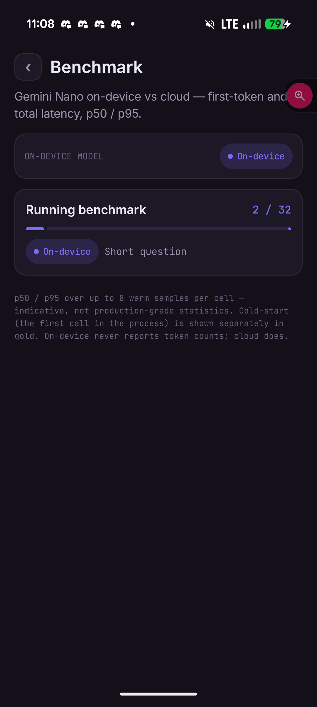
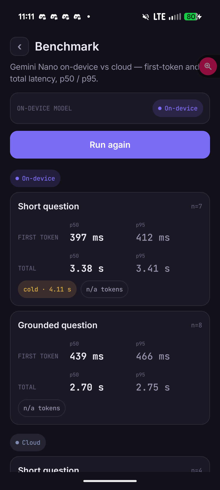
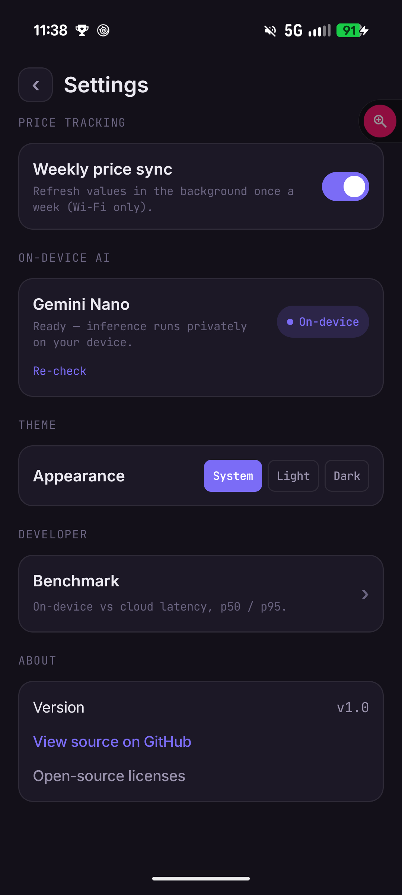

# Arcana

**A privacy-first Android companion for serious collectors — powered by on-device AI.**

Arcana catalogs a collection of *anything* — Funko Pops, FigPins, trading cards, sneakers — and uses **on-device Gemini Nano** to do what cloud apps can't or won't: "chat with your collection," value tracking over time, weekly AI summaries, and (soon) instant in-store identification. Every inference attempts on-device first; the cloud is a fallback, never the default. Your collection's data stays on your device.

> **Status: 🚧 In active development (Week 4 of a 12-week build).** Built in the open as a portfolio piece demonstrating production-grade on-device AI on Android. See [What works today](#what-works-today) for exactly what runs, and the [benchmark](#benchmark-on-device-vs-cloud) for measured latency.

<!-- HERO GIF — the capture cascade (segmentation → classification → OCR → catalog → cloud fallback) lands Week 7 and becomes the lead visual here. Until then, "Ask Arcana" on-device leads: -->

<p align="center">
  
</p>

<p align="center"><em>"Ask Arcana" answering a grounded collection question — streamed token-by-token from <strong>Gemini Nano on-device</strong> (937&nbsp;ms to first token, 3.5&nbsp;s total), with the retrieval context and the on-device badge shown.</em></p>

---

## Why this project

- **Privacy by construction.** The whole point is that inference happens on the device. Where each call executed (`OnDevice` vs `Cloud`) is captured as first-class telemetry, read straight from the SDK — not an afterthought, and not guessed.
- **Real data, not toy data.** Bootstrapped from a real ~500-item HobbyDB export (~$29k tracked value, 60% digital/NFT). The importer survives real-world CSV quirks (`=HYPERLINK()` wrappers, comma-separated multi-value fields, leading-zero UPCs), not a clean fixture.
- **Measurement rigor.** On-device isn't a checkbox — it's measured. The in-app [benchmark](#benchmark-on-device-vs-cloud) sweeps Nano vs cloud and reports p50/p95 first-token and total latency, cold vs warm, forced onto each engine through the same interface the app uses.

## What works today

Weeks 1–4, all verified on a physical **Pixel 10 Pro XL** (Tensor G5, Gemini Nano on-device):

- **Import → portfolio.** HobbyDB CSV → Room → a value-first portfolio home: tracked total, week-over-week delta, a live sparkline, and a duplicate-aware per-list breakdown.
- **"Ask Arcana."** A grounded chat over your collection that **streams token-by-token from Gemini Nano on-device**, with a badge showing where each answer ran and one-tap "compare on cloud."
- **On-device weekly summary.** A "what moved this week" card generated on-device via **ML Kit GenAI Summarization** (with a Gemini Nano fallback), narrating your own tracked price deltas — never an external feed.
- **Value tracking.** A `PriceProvider` seam (mock stand-in for eBay Browse) writing a `ValueSnapshot` time-series; per-item 90-day charts; a weekly background sync worker.
- **Benchmark screen.** Tap *Run benchmark* → live per-cell progress → a designed p50/p95 results surface, on-device vs cloud, first-token vs total, cold-start called out separately.
- **Settings.** Working background-sync toggle, on-device AI readiness readout, live light/dark theme.

Hybrid inference is real: under `PREFER_ON_DEVICE` the SDK runs Nano on-device and transparently falls back to cloud (`gemini-2.5-flash-lite`) when the model isn't provisioned — and the app reports which one actually served, per call.

## Benchmark: on-device vs cloud

Measured through the in-app benchmark on the Pixel 10 Pro XL — the same `GeminiService` seam that powers the app, forced onto each engine via `RoutingHint`. p50 over warm samples (small N — *indicative, not production-grade statistics*); cold-start is the first call in the process, reported separately.

| Prompt | Engine | First-token (p50) | Total (p50) | Output tokens |
|---|---|--:|--:|--:|
| Short | **On-device (Nano)** | **~0.40 s** | ~3.4 s | n/a¹ |
| Short | Cloud (2.5 Flash-Lite) | ~0.8–1.0 s | ~0.8–1.0 s | ~30 |
| Grounded | **On-device (Nano)** | **~0.44 s** | ~2.7 s | n/a¹ |
| Grounded | Cloud (2.5 Flash-Lite) | ~0.61 s | ~0.61 s | ~18 |
| Short (cold start) | On-device (Nano) | ~0.8 s | ~4–5.7 s | n/a¹ |

**The tradeoff, measured:** on-device delivers the **first token faster than the cloud** (~0.4 s vs ~0.6–1.0 s — no network round-trip), but generates the **full answer ~3–4× slower** (Nano decodes ~36 tok/s locally). You buy privacy and a snappier first token; you pay in total latency. That is exactly the curve an on-device-AI decision turns on, and the point of shipping the benchmark rather than asserting "it's fast."

¹ On-device inference never reports token counts (a Firebase-AI on-device limitation); the UI renders "n/a", never a misleading 0. Cloud populates them.

| Live progress | Results | Settings |
|---|---|---|
|  |  |  |

## Architecture

All model access sits behind one honest abstraction, so features never touch Firebase (or ML Kit, or ExecuTorch) types directly — swapping the backend is a DI binding change, not a call-site rewrite:

```kotlin
interface GeminiService {
    fun generateText(prompt: String, routingHint: RoutingHint = RoutingHint.Auto): Flow<InferenceResult>
}

data class InferenceMetadata(
    val executedOn: InferenceLocation,     // OnDevice | Cloud — read from the SDK on every call
    val totalLatencyMs: Long,
    val firstTokenLatencyMs: Long?,        // kept separate — Nano's cold start lives here
    val outputTokenCount: Int?,
)
```

The same pattern applies to five pluggable interfaces (`GeminiService`, `CollectibleRepository`, `CollectionImporter`, `CatalogProvider`, `PriceProvider`) and one sealed domain model (`Collectible`). The benchmark reuses the *same* seam, so a future `ExecuTorchGeminiService` (Gemma 3 1B, Week 7) slots in as another benchmark column with no screen changes.

The identification centerpiece (Week 7) is a **confidence-based cascade** that short-circuits early and only reaches the cloud when on-device confidence is too low: on-device segmentation → on-device classification (Nano) → OCR → local collection lookup → cloud fallback (Gemini multimodal). See [DESIGN.md](DESIGN.md) for the full architecture and [SCREENS.md](SCREENS.md) for the screen/state model.

## Tech stack

- **Android:** Kotlin, Jetpack Compose, Material 3, Hilt, Room, Coroutines/Flow, WorkManager, Coil
- **On-device AI (now):** Firebase AI Logic hybrid inference (`firebase-ai` + `firebase-ai-ondevice`), Gemini Nano via AICore; ML Kit GenAI Summarization
- **On-device AI (roadmap):** LiteRT for on-device RAG embeddings, ExecuTorch (Gemma 3 1B) as a same-interface backend swap
- **Testing:** JUnit, Turbine, MockK, Compose UI test; a device benchmark harness for latency

## Requirements & setup

**Build:** Android Studio with AGP 9.2 / Gradle 9.4.1 / JDK 21, `compileSdk 37`. From the CLI, prefix the JDK: `JAVA_HOME=".../Android Studio/jbr" ./gradlew :app:installDebug`.

**On-device inference:** a physical device with AICore + Gemini Nano (Pixel 9/10 series; a Tensor-G5 Pixel 10 for Nano v3). The Nano model is provisioned through Google Play system updates and can un-provision across updates — the app checks readiness and can trigger a re-download. Emulators won't run the on-device path.

**Firebase config (bring your own):** `google-services.json` is intentionally **not committed**. To build:
1. Create a Firebase project and add an Android app with package `com.aashishgodambe.arcana`.
2. Enable **Firebase AI Logic** (Gemini Developer API provider).
3. Drop the downloaded `google-services.json` into `app/`.

## Roadmap

| Week | Milestone | Status |
|---|---|---|
| 1–2 | CSV import → Room → portfolio grid → "Ask Arcana" answers streamed on-device | ✅ |
| 3 | Firebase hybrid escalation; on-device weekly summary (ML Kit GenAI) | ✅ |
| 4 | p50/p95 on-device-vs-cloud benchmark screen, Settings, README | ✅ |
| 7 | Capture cascade (camera → segmentation → OCR → catalog); self-deployed **Gemma 3 1B (ExecuTorch)** behind the same `GeminiService` | ◻︎ |
| 9 | On-device RAG: embed each item (LiteRT), semantic search over the collection | ◻︎ |
| 10 | Eval harness: on-device vs cloud vs fine-tuned identification accuracy | ◻︎ |

## About

Built by **Aashish Godambe** ([@aashishg11](https://github.com/aashishg11)) — Senior Android Engineer focused on on-device AI. Companion project: [Ansa Aura](https://github.com/aashishg11/ansa-aura), a private family AI home platform (edge AI/systems, complementary to Arcana's mobile-first focus).
