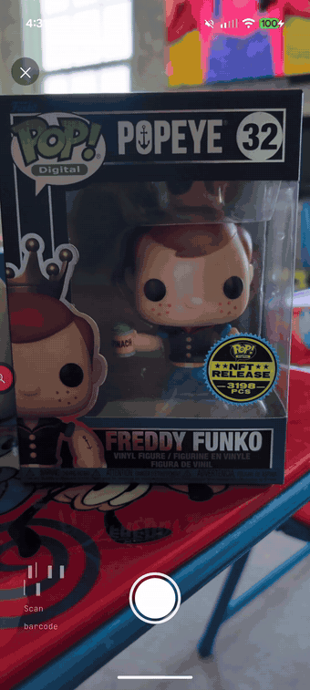
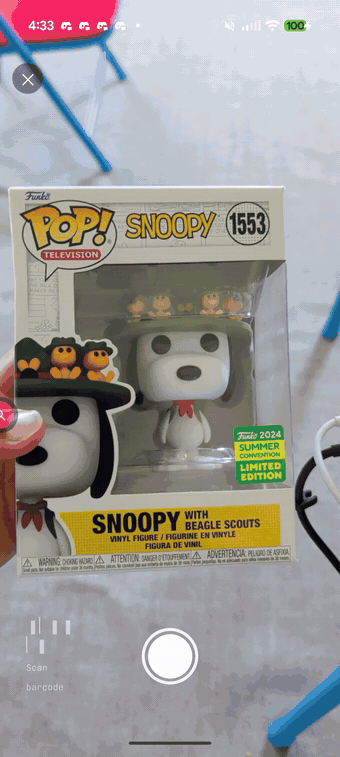

# Arcana

**A privacy-first Android companion for serious collectors — powered by on-device AI.**

Arcana catalogs a collection of *anything* — Funko Pops, FigPins, trading cards, sneakers — and uses **on-device Gemini Nano** to do what cloud apps can't or won't: "chat with your collection," value tracking over time, weekly AI summaries, and (soon) instant in-store identification. Every inference attempts on-device first; the cloud is a fallback, never the default. Your collection's data stays on your device.

> **Status: 🚧 In active development (Week 9 of a 12-week build).** Built in the open as a portfolio piece demonstrating production-grade on-device AI on Android. **Six of eight Google `ai-samples` on-device capabilities are shipped.** See [What works today](#what-works-today) for exactly what runs, and the [benchmark](#benchmark-three-engines-measured) for measured latency across three engines.

<p align="center">
  
  &nbsp;&nbsp;
  
</p>

<p align="center"><em>The capture flow — point the phone at a Funko box and watch the AI happen in front of you: the segmentation outline snaps on, the <code>#NNN</code> OCR callout lands, the catalog chain walks, and the identity settles. An <strong>owned</strong> pop resolves <strong>entirely on-device</strong> in ~1.6&nbsp;s, no network (left); an <strong>unowned</strong> pop <strong>escalates to cloud</strong> — the badge flips on-device→cloud (right) — then saves into your collection with a live eBay value.</em></p>

---

## Why this project

- **Privacy by construction.** The whole point is that inference happens on the device. Where each call executed (`OnDevice` vs `Cloud`) is captured as first-class telemetry, read straight from the SDK — not an afterthought, and not guessed.
- **Real data, not toy data.** Bootstrapped from a real ~500-item HobbyDB export (~$29k tracked value, 60% digital/NFT). The importer survives real-world CSV quirks (`=HYPERLINK()` wrappers, comma-separated multi-value fields, leading-zero UPCs), not a clean fixture.
- **Measurement rigor.** On-device isn't a checkbox — it's measured. The in-app [benchmark](#benchmark-three-engines-measured) sweeps Nano vs my own Gemma vs cloud and reports p50/p95 first-token and total latency, cold vs warm, forced onto each engine through the same interface the app uses.

## What works today

Weeks 1–9, all verified on a physical **Pixel 10 Pro XL** (Tensor G5, Gemini Nano on-device):

- **Capture → identify → save (the hero).** Point the camera at a Funko box and the identification cascade runs **visibly**: on-device subject **segmentation** (masked outline + scanline), **OCR** of the Pop number (the floating `#NNN` callout), on-device **Gemini Nano** multimodal read, a **catalog chain** (your collection → cloud multimodal), and the **on-device↔cloud badge** flipping on escalation. An owned pop settles **on-device in ~1.6 s with no network**; an unowned pop escalates to cloud. Then **save it** into a chosen list with a live eBay value — or "Add another" if you already own it. Four `ai-samples` capabilities light up in one feature (subject segmentation, on-device multimodal, text recognition, cloud multimodal). A single-frame OCR glyph misread is caught by a **majority vote across a burst of frames**.
- **Live eBay market value.** A real **eBay Browse** integration (OAuth app token, `item_summary/search`) prices each pop from the actual market — median active listing + the cheapest current listings by total (price + shipping). Queries disambiguate generic names by **product line and franchise** (a box's "Freddy Funko *as Popeye* #32" prices the right pop, not every Freddy Funko).
- **Import → portfolio.** HobbyDB CSV → Room → a value-first portfolio home: tracked total, week-over-week delta, a live sparkline, and a duplicate-aware per-list breakdown.
- **"Ask Arcana," on three engines.** A grounded chat over your collection that **streams token-by-token on-device**, with a badge showing where each answer ran. The engine is a **live, user-selectable choice** — Gemini Nano (default), **my own self-deployed Gemma 3 1B**, or cloud.
- **My own model, shipped.** A self-quantized **Gemma 3 1B (INT4)** runs in-process on the device via **LiteRT / MediaPipe LLM Inference** (CPU), behind the exact same `GeminiService` interface as Nano and cloud. Pick it in Settings → Ask Arcana streams from it with a gold "Your Gemma" badge. (See [Bringing my own model on-device](#bringing-my-own-model-on-device).)
- **On-device weekly summary.** A "what moved this week" card generated on-device via **ML Kit GenAI Summarization** (with a Gemini Nano fallback), narrating your own tracked price deltas — never an external feed.
- **Value tracking.** A `PriceProvider` seam (real eBay Browse, mock fallback) writing a `ValueSnapshot` time-series; per-item 90-day charts; a weekly background sync worker.
- **Three-engine benchmark.** Tap *Run benchmark* → live per-cell progress → a designed p50/p95 results surface comparing **Nano vs my Gemma vs cloud**, first-token vs total, cold-start called out separately.
- **Settings.** The engine picker, a working background-sync toggle, on-device AI readiness readout, live light/dark theme.

Hybrid inference is real: under `PREFER_ON_DEVICE` the SDK runs Nano on-device and transparently falls back to cloud (`gemini-2.5-flash-lite`) when the model isn't provisioned — and the app reports which one actually served, per call.

<p align="center">
  
</p>
<p align="center"><em>The engine picker in Settings — Nano stays the default (zero app-resident memory); "Your Gemma" is opt-in and presence-gated on the side-loaded model.</em></p>

## Bringing my own model on-device

Nano is Google's model. The harder question a portfolio should answer is: **can *you* take an open model, quantize it yourself, and ship it on-device behind the same interface?** Arcana does — and the interesting part is what the measurement said.

I self-quantized **Gemma 3 1B to INT4** and deployed it two ways — first with **ExecuTorch** (Week 5), then evaluated Google's **LiteRT-LM** (Week 6) — and benchmarked both against Nano on the Pixel's **Tensor G5**. The verdict is a **negative result reached by measurement**, which is the whole story:

- **The TPU is a dead end for decode.** The Tensor G5 NPU *does* engage (the Google-Tensor dispatch delegate loads and claims partitions), then fails with `contradictory buffer requirements` / `InvalidArgument` and falls back to CPU — [LiteRT #7787](https://github.com/google-ai-edge/LiteRT/issues/7787), reproduced **in-app** through the shipping MediaPipe AAR, not just my from-source build.
- **The GPU is a dead end too.** The G5's GPU is an Imagination **PowerVR**, and LiteRT disables GPU weight-prep for PowerVR/Mali/Broadcom — decode collapses to ~6 tok/s.
- **So the win came from the boring layer.** LiteRT's **CPU** path (XNNPACK, INT4) beats my ExecuTorch build on *both* axes — **27.4 tok/s / 1077 MB** vs 19.9 tok/s / 1477 MB — because its per-layer-embedder design keeps the embedding from materializing to fp32. "Use the vendor runtime on the vendor's chip" was right, for an unglamorous reason. Two independent toolchains (my Bazel build and Google's AAR) reach the identical CPU-only conclusion.

**The ship decision:** Nano stays the **default** — it runs out-of-process in AICore, so it costs **zero app-resident memory**; a permanently-resident 1 GB own-model shouldn't be forced on every user. The own-model is a **user-selectable** engine, proving the *producer* capability without paying its footprint by default. Model delivery is a dev **side-load** (the ~584 MB INT4 file isn't bundled in the APK); the picker presence-gates the option accordingly.

The payoff for the architecture: this was a **full rewrite of the inference layer** — native runtime, a streaming listener bridged to a `Flow`, a single-inference `Mutex`, side-load lifecycle — that dropped in behind the **unchanged** `GeminiService` interface. The call sites, the benchmark, and the badge didn't move. That's the abstraction earning its keep.

## Benchmark: three engines, measured

Measured through the in-app benchmark on the Pixel 10 Pro XL — the same `GeminiService` seam that powers the app, forced onto each engine via `RoutingHint`. p50/p95 over warm samples (small N — *indicative, not production-grade statistics*); cold-start is the first call in the process, reported separately.

| Prompt | Engine | First-token (p50) | Total (p50) | Output tokens |
|---|---|--:|--:|--:|
| Grounded | **Nano** (on-device) | **0.44 s** | 2.70 s | n/a¹ |
| Grounded | **Your Gemma** (LiteRT INT4, CPU) | 1.86 s | 3.02 s | 28 |
| Grounded | **Cloud** (2.5 Flash-Lite) | 0.45 s | 0.49 s | 17 |
| Short | **Nano** (on-device) | **0.39 s** | 3.35 s | n/a¹ |
| Short | **Your Gemma** (LiteRT INT4, CPU) | 0.58 s | 1.88 s | 31 |
| Short | **Cloud** (2.5 Flash-Lite) | 0.80 s | 0.80 s | 28 |

**What the numbers say:** there's no free lunch. **Nano** gives the fastest first token (no network, TPU prefill) but can't report token counts. **Cloud** wins wall-clock total when the network is good. **My Gemma** is the honest middle — competitive decode, real token counts, and a first-token that scales with prompt length because CPU prefill is linear in tokens (0.58 s short → 1.86 s grounded). It's the *engineering* answer, not the fastest number: my own model, running privately, on a phone. Shipping the benchmark — rather than asserting "it's fast" — is the point.

¹ Nano never reports token counts (a Firebase-AI on-device limitation); the UI renders "n/a", never a misleading 0. My Gemma (`sizeInTokens`) and cloud both do. Your Gemma's one-time ~3 s model load is amortized once per process and excluded from these figures.

| Engine picker → live switch | Three-engine results | On-device answer |
|---|---|---|
|  |  |  |

## Architecture

All model access sits behind one honest abstraction, so features never touch Firebase (or ML Kit, or ExecuTorch) types directly — swapping the backend is a DI binding change, not a call-site rewrite:

```kotlin
interface GeminiService {
    fun generateText(prompt: String, routingHint: RoutingHint = RoutingHint.Auto): Flow<InferenceResult>
}

data class InferenceMetadata(
    val executedOn: InferenceLocation,     // OnDevice | OnDeviceOwnModel | Cloud — read from the SDK/runtime per call
    val totalLatencyMs: Long,
    val firstTokenLatencyMs: Long?,        // kept separate — Nano's cold start lives here
    val outputTokenCount: Int?,
)
```

The abstraction has now been proven the hard way: three concrete engines live behind that one interface — `HybridGeminiService` (Nano + cloud), `LiteRtGeminiService` (my self-quantized Gemma via the LiteRT/MediaPipe runtime), and a `DelegatingGeminiService` that routes to whichever the Settings picker selected. The picker, the benchmark's third column, and the badge's third colour all fell out of that one seam **with no call-site changes**. The same pattern applies to five pluggable interfaces (`GeminiService`, `CollectibleRepository`, `CollectionImporter`, `CatalogProvider`, `PriceProvider`) and one sealed domain model (`Collectible`).

The identification centerpiece — the **capture cascade** — ships as a **confidence-based `Flow<CascadeState>`** that short-circuits early and only reaches the cloud when on-device confidence is too low: OCR → on-device subject segmentation → on-device Nano multimodal read (off the critical path) → a `CatalogProvider` chain (your collection → cloud multimodal) → settle. The composed-confidence gate keeps an owned pop entirely on-device; the UI is a pure *rendering* of that stream. See [DESIGN.md](DESIGN.md) for the full architecture and [SCREENS.md](SCREENS.md) for the screen/state model.

## Tech stack

- **Android:** Kotlin, Jetpack Compose, Material 3, Hilt, Room, Coroutines/Flow, WorkManager, Coil, **CameraX**
- **On-device AI (now):** Firebase AI Logic hybrid inference (`firebase-ai` + `firebase-ai-ondevice`), Gemini Nano via AICore (text + **multimodal** via the ML Kit GenAI **Prompt API**); ML Kit **Summarization**, **subject segmentation**, **text recognition**, **barcode scanning** (the capture cascade); a self-quantized **Gemma 3 1B (INT4)** via **LiteRT / MediaPipe LLM Inference** (`tasks-genai`), CPU, as a same-interface engine
- **Market data:** real **eBay Browse** API (OAuth app token) behind the `PriceProvider` seam; credentials stay in a gitignored `ebay.properties`
- **On-device AI (roadmap):** LiteRT for on-device RAG embeddings (Week 10); cross-vendor NPU benchmark (Snapdragon / Hexagon)
- **Testing:** JUnit, Turbine, coroutines-test, device-free fakes for every seam; a device benchmark harness for latency

## Requirements & setup

**Build:** Android Studio with AGP 9.2 / Gradle 9.4.1 / JDK 21, `compileSdk 37`. From the CLI, prefix the JDK: `JAVA_HOME=".../Android Studio/jbr" ./gradlew :app:installDebug`.

**On-device inference:** a physical device with AICore + Gemini Nano (Pixel 9/10 series; a Tensor-G5 Pixel 10 for Nano v3). The Nano model is provisioned through Google Play system updates and can un-provision across updates — the app checks readiness and can trigger a re-download. Emulators won't run the on-device path.

**Firebase config (bring your own):** `google-services.json` is intentionally **not committed**. To build:
1. Create a Firebase project and add an Android app with package `com.aashishgodambe.arcana`.
2. Enable **Firebase AI Logic** (Gemini Developer API provider).
3. Drop the downloaded `google-services.json` into `app/`.

**eBay Browse (optional — for live prices):** copy `ebay.properties.example` → `ebay.properties` (gitignored) and add your **production** eBay App ID / Cert ID; Gradle reads them into `BuildConfig`. Without it the app builds fine and value tracking falls back to the deterministic mock provider.

## Roadmap

| Week | Milestone | Status |
|---|---|---|
| 1–2 | CSV import → Room → portfolio grid → "Ask Arcana" answers streamed on-device | ✅ |
| 3 | Firebase hybrid escalation; on-device weekly summary (ML Kit GenAI) | ✅ |
| 4 | p50/p95 on-device-vs-cloud benchmark screen, Settings, README | ✅ |
| 5–7 | Self-quantize & deploy **Gemma 3 1B** on-device (ExecuTorch → LiteRT); measure across the Tensor G5's TPU/GPU/CPU; user-selectable engine picker; three-engine benchmark | ✅ |
| 8 | **Capture cascade engine** — segmentation → Nano multimodal → OCR → catalog → cloud fallback, as a per-stage `Flow<CascadeState>` (headless + dev harness) | ✅ |
| 9 | **Capture UI** — camera → animated Review (the cascade running visibly) → identify → **save to collection**; real **eBay Browse** price integration | ✅ |
| 10 | On-device **RAG** for Ask (LiteRT embeddings, semantic retrieval); `genai-writing-assistance` listing writer | ◻︎ |
| 11 | Cross-vendor NPU benchmark (Snapdragon/Hexagon); identification eval harness | ◻︎ |

## About

Built by **Aashish Godambe** ([@aashishg11](https://github.com/aashishg11)) — Senior Android Engineer focused on on-device AI. Companion project: [Ansa Aura](https://github.com/aashishg11/ansa-aura), a private family AI home platform (edge AI/systems, complementary to Arcana's mobile-first focus).
