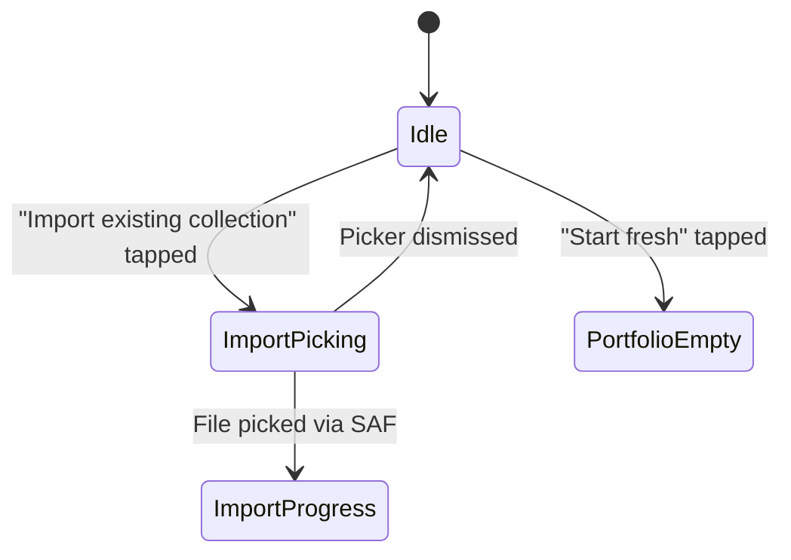
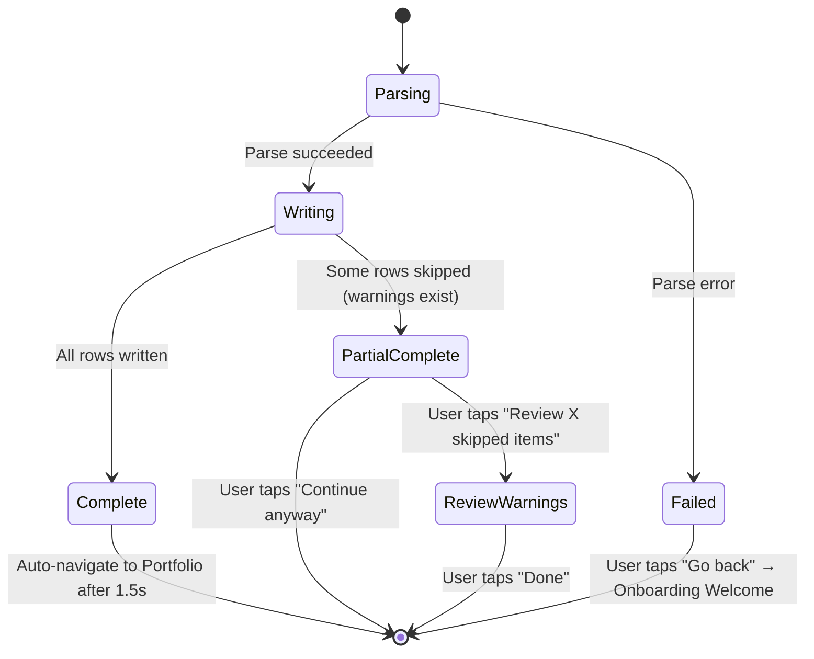
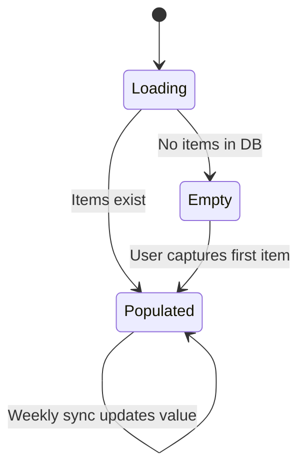
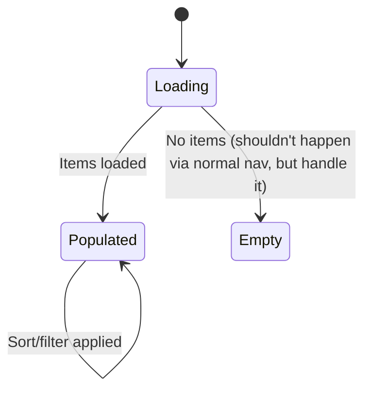
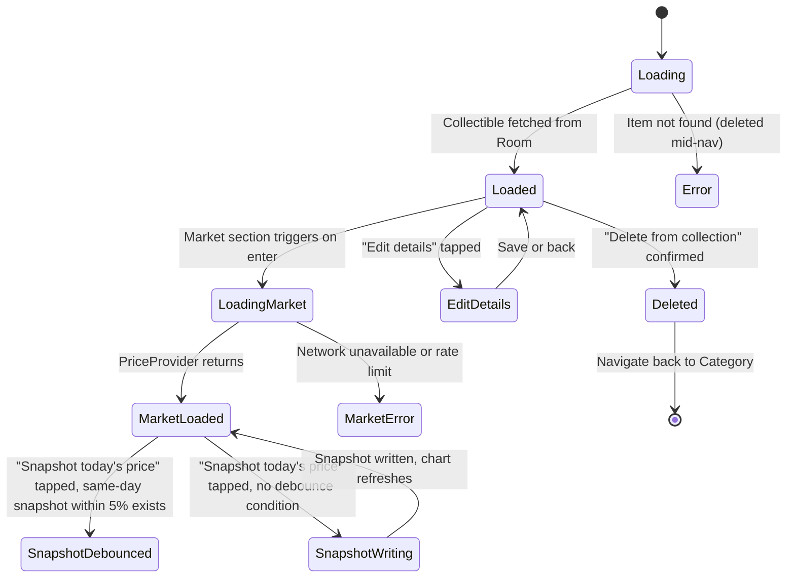
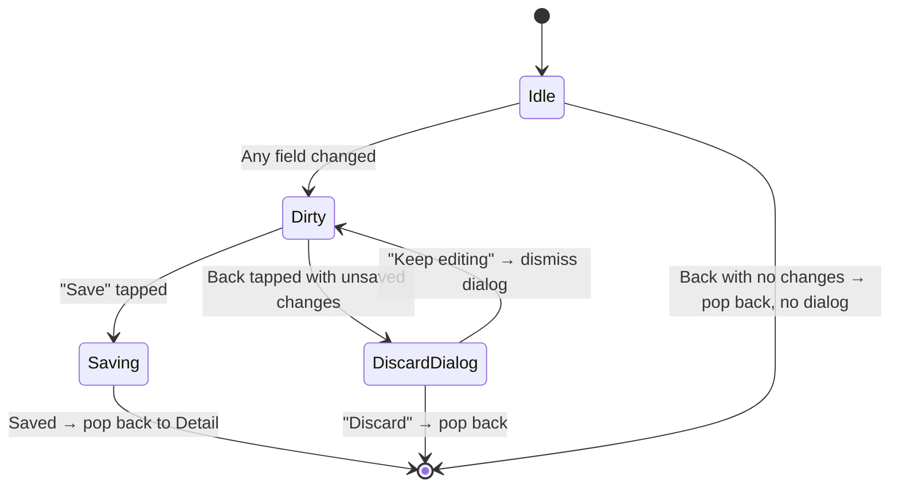
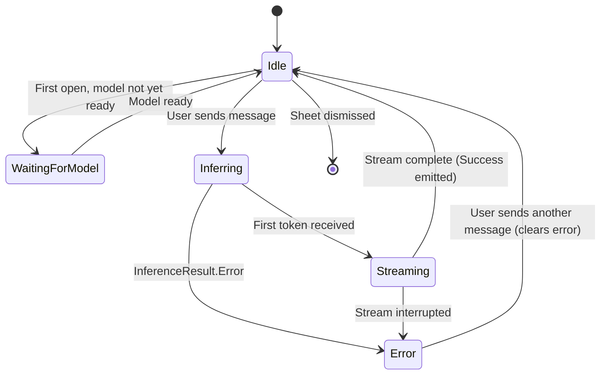
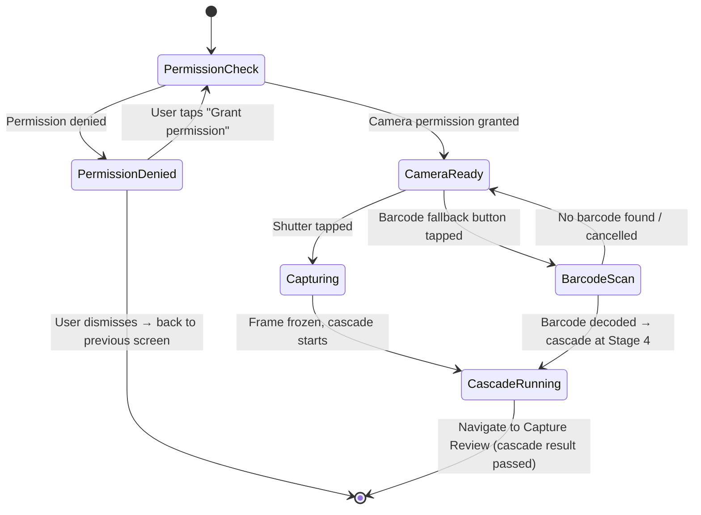
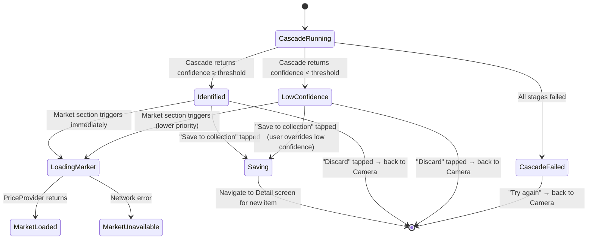
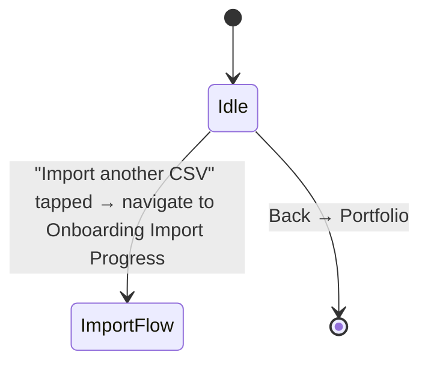

# Arcana — Screen Design

*Living document. Produced in Conversation 3. Covers every screen, every state, every transition. No pixels yet — that's Conversation 4.*

*Revisit at Week 4 (post-cascade), Week 7 (post-capture), Week 9 (post-RAG).*

---

## Screen inventory

| Screen | Route | Feature module |
|---|---|---|
| Onboarding — Welcome | `onboarding/welcome` | `:feature:onboarding` |
| Onboarding — Import Progress | `onboarding/import` | `:feature:onboarding` |
| Portfolio (Home) | `portfolio` | `:feature:portfolio` |
| Category | `category/{type}/{series}` | `:feature:collection` |
| Detail | `detail/{localId}` | `:feature:detail` |
| Edit Details | `detail/{localId}/edit` | `:feature:detail` |
| Chat — Ask Arcana | `chat` (bottom sheet / full-screen) | `:feature:chat` |
| Capture — Camera | `capture/camera` | `:feature:capture` |
| Capture — Review | `capture/review` | `:feature:capture` |
| Settings | `settings` | `:feature:settings` |

---

## Navigation graph

```mermaid
graph LR
  "Onboarding Welcome" -->|"Start fresh"| "Portfolio"
  "Onboarding Welcome" -->|"Import CSV"| "Onboarding Import Progress"
  "Onboarding Import Progress" -->|"Import complete"| "Portfolio"
  "Onboarding Import Progress" -->|"Import failed"| "Onboarding Welcome"

  "Portfolio" -->|"Tap series row"| "Category"
  "Portfolio" -->|"Tap settings icon"| "Settings"
  "Portfolio" -->|"Tap capture FAB"| "Capture Camera"
  "Portfolio" -->|"Tap Ask Arcana FAB"| "Chat"

  "Category" -->|"Tap item"| "Detail"
  "Category" -->|"Tap capture FAB"| "Capture Camera"
  "Category" -->|"Tap Ask Arcana FAB"| "Chat"

  "Detail" -->|"Tap Edit details"| "Edit Details"
  "Detail" -->|"Edit Details saved"| "Detail"
  "Detail" -->|"Tap capture FAB"| "Capture Camera"
  "Detail" -->|"Tap Ask Arcana FAB"| "Chat"

  "Capture Camera" -->|"Tap shutter"| "Capture Review"
  "Capture Camera" -->|"Cascade complete"| "Capture Review"
  "Capture Review" -->|"Save to collection"| "Detail"
  "Capture Review" -->|"Discard"| "Capture Camera"

  "Chat" -->|"Dismiss"| "previous screen"

  "Settings" -->|"Back"| "Portfolio"
  "Settings" -->|"Import another CSV"| "Onboarding Import Progress"
```

---

## 1. Onboarding — Welcome

Entry point on first launch only. Two equally weighted paths. Neither is the primary CTA.

### States



### State details

**Idle** — Two options presented with equal visual weight. No skip affordance; this is a one-time screen.

**ImportPicking** — Android Storage Access Framework file picker is open (`ACTION_OPEN_DOCUMENT`, MIME types: `text/csv`, `application/csv`, `text/comma-separated-values`). Arcana also receives the share intent for these MIME types so users can share a CSV email attachment directly.

**ImportProgress** — Transitions immediately to the Import Progress screen (separate screen, see §2).

**PortfolioEmpty** — Transitions to Portfolio with zero items. Empty state on Portfolio handles the "no items yet" case.

### Copy notes

"Start fresh" is the first option. Import path label: "Import from HobbyDB" (not "Import existing collection" — be specific). Below that: small text "Requires HobbyDB Premium export."

---

## 2. Onboarding — Import Progress

Shown while `HobbyDbCsvImporter` parses the CSV and `CollectibleRepositoryImpl` writes to Room. Blocking screen — user cannot skip past it. Resolves automatically on completion.

### States



### State details

**Parsing** — Indeterminate progress indicator. Label: "Reading your collection…"

**Writing** — Determinate progress bar (row index / total rows). Label: "Adding items… 47 of 283"

**Complete** — Checkmark animation. Label: "283 items added." Auto-navigates to Portfolio after 1.5 seconds with no user action required.

**PartialComplete** — Some rows were skipped (parse warnings). Shows count: "280 items added, 3 skipped." Two actions: "Review skipped items" (shows a list of warning strings from `ImportResult.warnings`) and "Continue anyway." User is in charge; don't block on warnings.

**Failed** — Full parse failure (`ImportResult.Failed`). Shows error message. Single action: "Go back." Re-importing is allowed from Welcome.

### Notes

No back gesture during Parsing or Writing — the import is in progress and interrupting it leaves the DB in a partial state. Back gesture re-enabled only on terminal states (Complete, PartialComplete, Failed).

---

## 3. Portfolio (Home)

Root destination. The app opens here after onboarding. Modelled like a portfolio / investment app — value first, collection breakdown second.

### States



### Layout (top to bottom)

**Header bar** — "Arcana" wordmark left. Settings gear icon right.

**Portfolio value section**
- Total estimated value: large display number ("$22,634")
- Value delta from last snapshot: "+$340 this week" in green / "–$120 this week" in red
- Sparkline or line chart of total portfolio value over time (last 90 days default). Tappable to expand to full chart view (future — not v1 interaction).
- Snapshot timestamp: "Updated Sunday · Sync now" (tapping "Sync now" triggers `SyncAllPrices` use case for impatient users)

**Collection breakdown**
Each collection type (Funko, FigPin, Pokémon) is a row showing type name, item count, and aggregate value. Tapping the row expands it inline to show series chips or sub-rows. Default: all types expanded on first open; state persisted after that.

Expanded Funko row shows series as sub-rows: series name, item count in that series, aggregate value. Tapping a series navigates to Category screen.

**Floating elements**
- Capture FAB (camera icon) — bottom right, always visible
- "Ask Arcana" entry — either a second FAB stacked above capture, or a persistent chip/pill anchored above the bottom edge. Ask Arcana is not a tab; it's a global action.

### Empty state

"Your collection is empty. Tap the camera to add your first item." Single CTA pointing to capture. No import prompt — they already had their chance at onboarding; don't re-surface it here as a primary action (Settings has "Import another CSV").

### Notes

"Sync now" triggers the same `WeeklyPriceSyncWorker` path on demand. It should show a subtle loading indicator on the delta line while running and update in place when done. Don't navigate away.

---

## 4. Category Screen

Reached by tapping a series row from the Portfolio breakdown. Shows all items in one series with a value trend at the top.

Route: `category/{collectibleType}/{seriesName}` — both params needed so the screen can scope the chart query and the item list independently.

### States



### Layout (top to bottom)

**Top bar** — Back arrow. Collection type label ("Funko Pop"). No title — the series chip row acts as the title.

**Series chip row** — Horizontally scrollable `LazyRow` of `FilterChip`s. "ALL" chip first, then individual series names (MARVEL, DC, STAR WARS, etc.). Selected chip is filled; others are outlined. Selecting a chip updates both the chart and the item list below. This is the series switcher — no dropdown needed for 5–15 items.

**Series value chart** — Line chart showing aggregate value of owned items in this series over time. Same data source as portfolio chart but scoped to selected series. When "ALL" is selected, chart shows aggregate for the whole collection type. Empty chart state: "Tracking starts after your first price sync."

**Item list** — Vertical scrollable list (not a grid — list gives room for name + value + series tags per row). Each row: thumbnail left, name + series tags right, estimated value far right. Tapping navigates to Detail.

**Sort/filter** — Icon in top bar. Bottom sheet with sort options: Name A–Z, Value high–low, Value low–high, Date added newest–oldest, NFT Redeemable first. Filter options: condition, exclusive to, NFT only toggle. Keep it simple in v1.

**Floating elements** — Capture FAB and Ask Arcana entry, same as Portfolio.

### Notes

The series chip row is the navigation control and the page title simultaneously. Don't add a separate static title — it wastes space and duplicates information.

When switching series via chip, the chart and list should update together. The chart animates its data transition; the list cross-fades. Avoid jarring full-screen recomposition.

---

## 5. Detail Screen

Single-item canonical view. Reached from Category list. Also the landing screen after a successful capture save.

Route: `detail/{localId}`

### States



### Layout (top to bottom)

**Header** — Back arrow. Overflow menu (Delete from collection, Add to HobbyDB deep-link).

**Image** — Full-width, segmented background if captured via Arcana; original HobbyDB image URL otherwise. Aspect ratio 1:1 or 4:3.

**Identity section** — Name (large), series tags as chips, exclusive-to label, "NFT Redemption Pop" badge if `isNftRedeemable = true`. This badge is purely a provenance label — it does not imply any tracked state.

**Ownership badge** — "You own X of these." For quantity > 1, tapping expands to show individual copy details (condition, storage location per copy — future, not v1).

**Market section** (shared component `MarketSection.kt`, also used on Capture Review)
- Median active listing price — large
- Top 3–5 active eBay listings: title, price, seller rating, "View on eBay" chip (Chrome Custom Tab)
- Freshness timestamp: "Listings from 2 minutes ago"
- Loading skeleton while `PriceProvider` is fetching
- Error state: "Couldn't load market data. Check your connection." No retry button — it retries automatically on next screen entry.

**"Snapshot today's price" button** — Below market section. Debounce state: if last snapshot is same-day and within 5%, button label changes to "Already up to date — snapped today at $X." Otherwise standard label.

**Value history chart** — Per-item time-series from `value_snapshots WHERE collectibleLocalId = ?`. Default: last 90 days. If fewer than 2 snapshots exist: "Price tracking started. First sync this Sunday." No empty axis.

**Edit details affordance** — "Edit details" text button or icon. Opens Edit Details screen.

**Secondary actions** — "Add another to my collection" (no grey-out; user decides), "Delete from collection" (destructive — confirm dialog before executing).

---

## 6. Edit Details Screen

Gap-fill editor for fields that are null after import or capture. Not a full re-edit of identity fields — those are catalog data.

Route: `detail/{localId}/edit`

### States



### Fields

Price paid (currency input), Acquired from (free text), Date purchased (date picker), Storage location (free text, e.g. "Shelf B, Box 3"), Private notes (multiline text). Item condition and packaging condition are also editable here — they come from import but the user may want to update them post-purchase.

Identity fields (name, series, Pop number, UPC) are read-only on this screen. They're catalog data, not user data.

### Notes

Keyboard-aware layout — fields scroll above the keyboard, Save button stays anchored above the keyboard. Standard `WindowInsets` handling.

---

## 7. Chat — Ask Arcana

Global entry point via FAB. Available from any screen. In v1 (Week 2–4) this is a single-turn Q&A backed by Gemini Nano / hybrid inference. In Week 9 it becomes full RAG with per-session multi-turn history.

### Presentation

Full-screen bottom sheet (`ModalBottomSheet`) that expands to ~90% of screen height. Not a separate route in the nav graph — it overlays the current destination. This is why it can be "accessible from anywhere" without the nav stack knowing about it.

### States



### Layout

**Sheet handle + "Ask Arcana" label** — top of sheet.

**Inference badge** — small chip: "On-device" / "Cloud" — updates after each response based on `InferenceMetadata.executedOn`. This is the portfolio demo artifact — it should be visible and designed, not hidden in a debug menu.

**Message list** — `LazyColumn` of user and assistant bubbles. Assistant bubble renders `StreamingText` component (token-by-token animation). In v1, history is in-memory for the session only — dismissed sheet clears history.

**Input row** — `TextField` + Send button. Disabled while `Inferring`. Hint text: "Ask about your collection…"

**Model not ready state** — "Setting up on-device AI… this only takes a moment." Shown in place of input row. Input re-enables when `modelReadinessFlow` emits ready.

**Error state** — inline in message list as an assistant bubble: "Couldn't get a response. Try again." with a Retry chip. Does not replace the input — user can type a new question instead.

### Notes

Multi-turn history is scoped to the session. `ChatViewModel` holds `List<ChatMessage>` in memory. On Week 9, the RAG grounding prompt prefix is prepended to each call but the session history accumulation pattern is the same.

`RoutingHint.OnlyOnDevice` is passed when `ConnectivityManager` reports no network. The caller knows it's offline; don't let the service attempt a cloud call and time out.

---

## 8. Capture — Camera Screen

New acquisitions only — this is for forward additions, not re-cataloging existing items. Available via FAB from any screen.

### States



### Layout

Full-screen camera preview. Standard CameraX viewfinder.

**Shutter button** — centered at bottom. Primary affordance. One tap captures.

**Barcode fallback** — small secondary button bottom-left. Label: "Scan barcode." Not hidden, not prominent. When the cascade returns low confidence on the review screen, the review screen prompts the user to try barcode — but the button is always available here for users who know they want it.

**Close button** — top-left X. Returns to previous screen.

**No viewfinder overlay instructions** — the camera screen's job is to capture a frame. Don't clutter it with "Center your Pop in the frame" guidance; it's condescending and the cascade handles messy framing.

### Permission denied state

Standard rationale UI: "Arcana needs camera access to identify new items." Two actions: "Grant permission" (re-triggers system permission dialog) and "Not now" (dismisses back to previous screen). No permanent denial handling in v1 — direct user to settings manually.

---

## 9. Capture — Review Screen

Post-cascade result screen. Shows the frozen frame, identification result, and market context. User confirms or discards.

### States



### Layout (top to bottom)

**Captured image** — large, top half of screen. Background removed (segmented). If segmentation failed, shows original frame.

**Cascade stage indicators** — visible progression while `CascadeRunning`: animated outline for segmentation, streaming text for classification ("Marvel character… red and black… Deadpool?"), OCR callout near box number area ("#001"), catalog lookup status line ("Checking your collection… eBay…"), on-device/cloud badge flip. These are designed features on the frozen frame, not debug logs.

**Identification result** — name, series, exclusive info. Source badge: "Identified on-device" / "Identified via eBay catalog" / "Identified via cloud." Confidence bar (thin, below the name).

**Already owned callout** — shown when identification matches an existing item: "You already own 2 of these." Additive information, not a blocker.

**Market section** — same `MarketSection.kt` component as Detail screen. Loads immediately after identification settles.

**"Wrong? Scan barcode"** — if confidence is high: small tertiary text link. If confidence is low: prominent secondary button. Same affordance, different visual weight based on context.

**Primary action** — "Save to collection" button. Always available, even on low confidence — user is in charge.

**Secondary action** — "Discard" text button. Returns to Camera screen.

### Low confidence state

Identification result section shows: "Not sure — this might be [name]" with a lower confidence bar. "Wrong? Scan barcode" is elevated to a secondary button. Market section still loads. Save is still available.

### Cascade failed state

Full-width error message: "Couldn't identify this item." Two actions: "Try again" (back to Camera) and "Add manually" (future — not v1). In v1 "Try again" is the only recovery path.

---

## 10. Settings Screen

Accessed via gear icon on Portfolio header.

### States

Simple — no async states except import re-trigger.



### Sections

**Collection** — "Import another CSV" (append-only; opens SAF picker then Import Progress screen). Future: "Export collection."

**Price sync** — "Background price sync" toggle (enables/disables `WeeklyPriceSyncWorker`). "Last synced: Sunday June 22" timestamp.

**AI** — "On-device AI status" — shows `modelReadinessFlow` state: "Ready" / "Downloading…" / "Not available on this device (using cloud)." Read-only. Future: model selector toggle (Nano vs Gemma vs cloud).

**About** — App version, GitHub link, licenses.

---

## Shared components

Two components appear on multiple screens and must be consistent:

**`MarketSection.kt`** — used on Detail and Capture Review. Takes a `PriceResult` and renders median active price, top listings with View on eBay links, and freshness timestamp. Handles loading skeleton and error states internally. Callers just pass the result; they don't manage market loading state.

**`InferenceBadge.kt`** — used on Chat and Capture Review. Shows "On-device" or "Cloud" based on `InferenceMetadata.executedOn`. Small chip, always visible when inference has run. This is the portfolio artifact — it should be a first-class design element, not a debug overlay hidden behind a developer option.

**`StreamingText.kt`** — used on Chat and on the Cascade Running state of Capture Review (classification stage text). Animates token-by-token as `InferenceResult.Streaming` events arrive. Needs to handle the transition from streaming to final text cleanly — no flash or recomposition artifact on `Success`.

---

## State decisions and rationale

**Import Progress blocks navigation.** Interrupting a partial import leaves the DB in an inconsistent state. The progress screen has no back gesture during active import. This is the right call even though it's unusual — explain it in the in-app copy ("Adding your collection… don't close the app").

**Ask Arcana is a bottom sheet, not a route.** A full route would force the back stack to manage chat context and would make "accessible from anywhere" complex. A `ModalBottomSheet` overlaying the current destination is simpler and matches the interaction model (it's a query tool, not a destination).

**Capture Review receives cascade result via nav argument, not by re-running the cascade.** The cascade runs once, the result is passed to the review screen. If the user discards and goes back to Camera, they capture a new frame and the cascade runs fresh. No cascade result is stored in the ViewModel across back/forward navigation.

**Low confidence does not block saving.** The user is always in charge. Low confidence changes the visual weight of the "Wrong? Scan barcode" affordance but never prevents saving.

**Market section loads on screen entry, not on demand.** There is no "Refresh" button on Detail or Capture Review. The market section is always live when the screen is visible. The "Snapshot today's price" button on Detail is a distinct action — it commits a `ValueSnapshotEntity` row to history, it doesn't trigger a market refresh.

---

## Open questions deferred to Conversation 4 (wireframes)

- Exact visual treatment of the cascade stage indicators on the frozen frame in Capture Review — animation timing, label positioning, layering over the image.
- Portfolio value chart interaction — tap to see a specific date's value? Or just a sparkline with no interaction in v1?
- "Ask Arcana" FAB visual treatment — stacked above capture FAB, or a separate pill/chip anchored differently?
- Category screen empty state — can happen if a series filter returns no items after a chip selection.
- Multi-quantity item display in Category list and Detail — "×2" badge on the list row, "You own 2 of these" on detail. Exact treatment TBD.
